# Projeto Haunted Castle

# Descrição Resumida do Projeto/Jogo

> O jogo Haunted Castle é baseado no estilo de jogo roguelike, onde o herói precisa vasculhar as salas na procura do vilão principal. Para tanto, ele irá precisar derrotar inimigos aliados do vilão. Na sua jornada, o héroi irá ficar mais forte e encontrar itens e equipamentos. Além disso, esse jogo não possui check points ou savepoints, então esse jogo não é muito longo e permite recomeçar o jogo caso o herói morra ou queira melhorar seu tempo (matar o vilão no menor tempo possível). Para garantir melhor rejogabilidade, a geração do mapa do jogo é parcialmente aleatória, combinando diferentes versões de cada nível sempre que o jogo é recomeçado. 

>W - Andar para cima
>
>A - Andar para a esquerda
>
>S - Andar para baixo
>
>D - Andar para a direita
>
>Q - Usar poção

>Para atacar, avance na direção do monstro

>R - Recomaçar a partida quando morrer ou ganhar

# Equipe
>* Artur
>* Marcos

# Arquivo Executável do Jogo

[Arquivo jar (jdk 17)](assets/game.jar)

[Arquivo jar (jdk 11)](assets/game_jdk11.jar)

PS: Para que o jogo funcione é necessário colocar o arquivo jar e a pasta assets no mesmo local.

# Slides do Projeto

## Slides da Apresentação Final
[Apresentação](assets/apresentacao.pptx)

[link google docs](https://docs.google.com/presentation/d/1B6teRCCtoXIbOURUIhgIFJ0BdB3L0MHDZnfgQQkIvsU/edit?usp=sharing)

## Relatório de Evolução
> Relatório de evolução, descrevendo as evoluções do design do projeto, dificuldades enfrentadas, mudanças de rumo, melhorias e lições aprendidas. Referências aos diagramas e recortes de mudanças são bem-vindos.

>O primeiro desafio foi a falta de experiência em como criar uma interface de jogo. Então vários testes foram realizados para testar o java swing e entender o funcionamento da criação de uma interface gráfica.
>
>No nosso jogo, algumas classes são instanciadas apenas uma vez. Em um primeiro momento, essas classes eram chamadas apenas de forma estática para evitar uma dupla instanciação. Após a aula de design patterns, lazy singleton foi implementado.
>
>A complexidade do nosso jogo depende diretamente da nossa criatividade para gerenciar os eventos durante o jogo. Então, foi difícil ponderar o que deveríamos fazer em uma primeira versão. Então, elaborou-se uma arquitetura de jogo base que pudesse receber upgrades.
>
>A principal lição aprendida foi a importancia do planejamento do projeto de maneira exaustiva. Ao longo do desenvolvimento do projeto, houve momentos em que adaptações foram feitas pois não tinhamos considerado certos aspectos no planejamento inicial.  Por exemplo, como reiniciar o jogo uma vez que o jogo chega ao seu fim (vitória ou derrota).

# Destaques de Código

> O primeiro destaque é o uso do método paintComponent do java swing para a criação da interface gráfica. O jogo possui 4 estados (tela inicial, tela principal, tela de vitória e tela de derrota) e a renderização é feita com base nesse estado. Por exemplo, no estado 1 (player jogando) o método vai ler o modelo e gerar o mapa. Além disso, o método paintComponent não precisa ser chamado em nenhum momento pois isso é feita de forma autônoma pelo javaswing, ou seja, o método será chamado quando ele detectar uma mudança (como se fosse um observer).

~~~java
public void paintComponent(Graphics graphics) {
		super.paintComponents(graphics);
		try {
			if(god.getGameState() == 0) {
			graphics.setColor(Color.BLACK);
			graphics.fillRect(0, 0, Window.WIDTH, Window.HEIGHT);
			renderer.firstScreen(graphics);
			}
			else if(god.getGameState() == 1) {
				if(!running) {
					this.startTime = System.currentTimeMillis();
					running = true;
				}
				graphics.setColor(Color.BLACK);
				graphics.fillRect(0, 0, Window.WIDTH, Window.HEIGHT);
				//renderer.drawFloor(graphics, castle.getCurrentFloor());
				//renderer.drawActors(graphics, castle.getCurrentFloor());
				renderer.rayTracing(graphics, castle.getCurrentFloor());
				renderer.messageBox(graphics, message);
				renderer.heroStatus(graphics, castle.getCurrentFloor().getHero(),(System.currentTimeMillis()-startTime)/1000);
			}
			else if(god.getGameState() == -1) {
				//gameover
				if(running) {
					this.stopTime = System.currentTimeMillis();
					this.running = false;
				}
				renderer.gameOverScreen(graphics, (stopTime - startTime)/1000);
				if(bestTime > 99999999)
					renderer.bestTime(graphics, 0);
				else
					renderer.bestTime(graphics, bestTime);
			}
			else if(god.getGameState() == 2) {
				//win
				if(running) {
					this.stopTime = System.currentTimeMillis();
					this.running = false;
				}
				renderer.victoryScreen(graphics, (stopTime - startTime)/1000);
				if((stopTime - startTime)/1000 < bestTime)
					bestTime = (stopTime - startTime)/1000;
				renderer.bestTime(graphics, bestTime);
			}
		}catch(Exception e) {
			e.printStackTrace();
		}
		repaint();
	}
~~~

# Destaques de Orientação a Objetos
> No jogo, as classes Hero e Enemy são classes filhas da classe mãe Actor. No método gameloop, um vetor actors que contém todos os inimigos e o herói é percorrido a cada iteração. Na versão atual, apenas o herói é inteligente o suficiente para usar itens, poções, e etc. A vantagem desse tipo de implementação é a facilidade de adaptar o código para fazer com que os inimigos possuam uma certa inteligência e também possam usar items como o herói.

## Código do Destaque OO
~~~java

	public void gameLoop() {
		boolean quit = false;
		while (quit == false) {
			sortFloorActors();
			int i = 0;
			while (gameState == 1) { // hp > 0; bossAlive.
				IActor actor = floorActors.get(i);
				actor.setEnergy(actor.getEnergy() + actor.getSpeed() * 10);
				if (actor.getEnergy() >= 1000) {
					while (true) {
						try {
							act(actor);
							break;
						} catch (InvalidMovement e) {
							e.printStackTrace();
						}
					}
					actor.setEnergy(actor.getEnergy() - 1000);
				}
				i = (i + 1) % floorActors.size();
				if (hero.getHp() <= 0)
					gameState = -1;
				else if (!bossAlive)
					gameState = 2;
				
			}
			while (gameState == -1 || gameState == 2) {
				System.out.print("");
				if (nextAction.getKey() == KeyEvent.VK_R) {
					gameState = 0;
					restart();
					
				}
			}
		}
	}
~~~

# Destaques de Pattern

## Diagrama do Pattern
> Foram usados 2 design patterns:
> 
> Singleton: Algumas classes só precisam ser instanciadas uma vez e o uso desse design pattern garante isso.
> 
>Facade: Do ponto de vista do usuário, quanto mais simples for para lançar o jogo melhor. A implementação desse design pattern faz com que o usuário precise apenas abrir o jogo e jogar!

## Código do Pattern
~~~java
public class Assembler {
	private static Assembler assembler;
	private IWindow window;
	private ICastleController castle;
	
	private Assembler() {}
	
	public static Assembler getInstance() {
		if (assembler == null) {
			assembler = new Assembler();
		}
		return assembler;
	}
	
public class App {
	private static God god;
	private static Assembler assembler;
	
	public static void main(String[] args) {
		executeGame(); //facade pattern
	}
	
	private static void executeGame() {
		assembler = Assembler.getInstance();
		assembler.newGame();
		god = God.getInstance();
		god.nameHero();
		god.gameLoop();
	}
}
~~~

# Conclusões e Trabalhos Futuros

>Por ser um jogo de RPG, várias melhorias podem ser feitas para melhorar a experiência do usuário e deixar o jogo mais divertido/desafiador. No início, foi difícil ponderar o que poderia ser feito no tempo de um mês. Abaixo seguem algumas melhorias que poderiam ser implementadas:
>
>Mais tipos de ações: atualmente o herói pode se mover, usar poção e atacar um inimigo. Ações como esconder, fugir, e defender poderiam ser adicionados ao jogo.
>
>Movimentação mais otimizada monstros: Em certas condições, é possível prender um monstro em uma parede e o monstro não consegue perseguir o herói. Isso é bem díficil de acontecer na versão atual, mas algo mais interessante poderia ser feito utilizando grafos.
>
>Novos itens, texturas, monstros, equipamentos: Melhorias no design do jogo de maneira geral.
>
>Multiplayer: Adicionar um segundo herói ou mesmo um pet que ajude o herói (pode ser um bot ou um outro jogador)
>
>Sistema de ataque mais complexo: Ataques à distância, uso de magias
>
>Mais inteligência para os monstros: Na versão atual, os monstros apenas seguem o herói quando ele se aproxima e atacam ele até a sua morte. Alguns monstros, poderiam ser mais inteligentes e fazer ações mais estratégicas do que apenas perseguir e atacar.
>
>Implementação de efeitos sonoros: A proposta inicial era usar sons de suspenses, músicas de combate, sons de ataques e etc, mas devido há um bug que acontecia em função do computador utilizado, isso não foi implementado.
>
>Raytracing: Na versão atual, alguns cantos não são exibidos quando deriam ser. Então uma melhoria seria criar um lógica que melhorasse esse aspecto.

# Documentação dos Componentes

# Diagramas

## Diagrama Geral da Arquitetura do Jogo

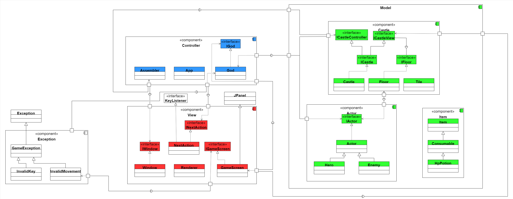

> A arquitetura do Jogo é do tipo MVC (Model-View-Controller). No diagrama acima, percebe-se que a comunicação entre os três principais elementos (MVC) ocorre de maneira triangular, onde cada um deles interage com ambos os outros. Além disso, a disponibilização de métodos entre componentes ocorre sempre por meio de interfaces.

## Diagrama Geral de Componentes

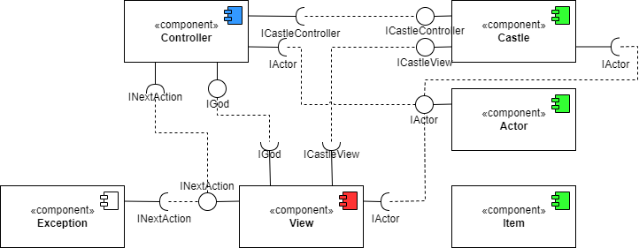

## Componente `Castle`

> Responsável por modelar o mapa do jogo, podendo devolver informações sobre o estado atual dele. Possui 3 classes: Castle, que representa o mapa inteiro do jogo, com todos os andares (níveis); Floor, que representa cada andar (nível) do jogo, possuindo uma matriz de Tiles; e Tile, que é a projeção de uma célula de um andar.

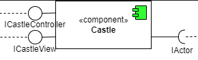

**Ficha Técnica**
item | detalhamento
----- | -----
Classes | `src.model.castle`
Autores | `Artur e Marcos`
Interfaces | `ICastleController, ICastleView, IFloor, ICastle`

### Interfaces

Interfaces associadas a esse componente:

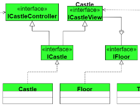

Interface agregadora do componente em Java:

~~~java
public interface ICastle extends ICastleController, ICastleView {
}
~~~

## Componente `Actor`

> Modela os atores (Herói e inimigos), podendo devolver informações como os atributos e a posição atual de cada ator.

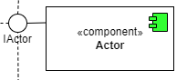

**Ficha Técnica**
item | detalhamento
----- | -----
Classes | `src.model.actor`
Autores | `Artur e Marcos`
Interfaces | `IActor`

### Interfaces

Interfaces associadas a esse componente:

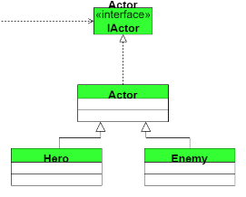

## Componente `Item`

> Modela os itens que os atores podem usar (por enquanto, apenas poções, que só podem ser usadas pelo herói).

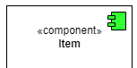

**Ficha Técnica**
item | detalhamento
----- | -----
Classes | `src.model.actor`
Autores | `Artur e Marcos`
Interfaces | `-`

## Componente `Controller`

> Responsável pela criação e atualização do estado do jogo. Oferece, para o View, informações sobre o estado do jogo (se está rodando; na tela inicial; etc).

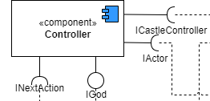

**Ficha Técnica**
item | detalhamento
----- | -----
Classes | `src.controller`
Autores | `Artur e Marcos`
Interfaces | `IGod`

### Interfaces

Interfaces associadas a esse componente:

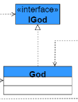

## Componente `View`

> Responsável pela interface gráfica do jogo e pela leitura do teclado. Oferece qual foi a última tecla digitada, a possibilidade de criação da janela e a possibilidade de apresentação de uma mensagem na tela.

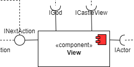

**Ficha Técnica**
item | detalhamento
----- | -----
Classes | `src.view`
Autores | `Artur e Marcos`
Interfaces | `IWindow, INextAction, IGameScreen`

### Interfaces

Interfaces associadas a esse componente:

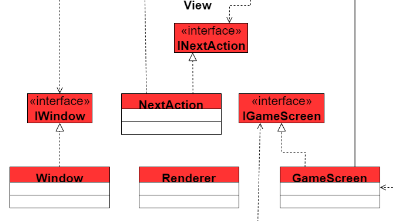

## Componente `Exception`

> Contém as exceções do jogo.

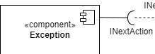

**Ficha Técnica**
item | detalhamento
----- | -----
Classes | `src.exception`
Autores | `Artur e Marcos`
Interfaces | `-`

## Detalhamento das Interfaces

### Interface `IActor`

Interface que explicita os acessos que o controller e o view podem ter dos atores (monstros e herói). Para facilitar a interpretação do código, a interface IActor é resultado de duas interfaces  IActorController e IActorView.

~~~java
public interface IActor extends IActorController, IActorView {
}
public interface IActorController {
	public int getSpeed();
	public int getEnergy();
	public void setEnergy(int energy);
	public int getPosX();
	public void setPosX(int posx);
	public int getPosY();
	public void setPosY(int posy);
	public int getHp();
	public void setHp(int hp);
	public int getArmour();
	public int getDamage();
	public void usePotion();
	public void addPotion();
	public void improveArmour();
	public void improveDamage();
	public boolean isArmorIsEquipped();
	public void setArmorIsEquipped(boolean armorIsEquipped);
	public boolean isWeaponIsEquipped();
	public void setWeaponIsEquipped(boolean swordIsEquipped);
	public int countPotions();
	public void setName(String name);
	public void removeLetterName();
	public boolean isHeroSeen();
	public void setHeroSeen(boolean heroSeen);
	public void restart();
	public int getArmourLevel();
	public int getWeaponLevel();
}

public interface IActorView {
	public int getSpeed();
	public int getPosX();
	public int getPosY();
	public int getHp();
	public int getArmour();
	public int getDamage();
	public String getName();
	public String getId();
}
~~~

Método | Objetivo
-------| --------
`getSpeed` | Retorna a velocidade do ator.
`getEnergy` | Retorna a energia do ator.
`setEnergy` | Atualiaza a energia do ator.
`getPosX` | Retorna a posição horizontal X.
`setPosX` | Atualiza a posição horizontal X.
`getPosY` | Retorna a posição vertical Y.
`setPosY` | Atualiza a posição vertical Y.
`getHp` | Retorna a vida do ator .
`setHp` | Atualiza a vida do ator.
`getArmour` | Retorna o valor da armadura do ator.
`getDamage` | Retorna o dano causado pelo ator.
`usePotion` | Incrementa a vida do ator caso tenha uma poção .
`addPotion` | Adiciona uma poção ao inventário do ator.
`improveArmour` | Incrementa o valor da armadura do ator .
`improveDamage` | Incrementa o valor do dano do ator.
`isArmorIsEquipped` | Retorna se o ator está usando uma armadura.
`setArmorIsEquipped` | Define que o ator está usando uma armadura.
`isWeaponIsEquipped` | Retorna se o ator está usando uma arma.
`setWeaponIsEquipped` | Define que o ator está usando uma arma.
`countPotions` | Retorna a quantidade de poções que o ator possui .
`setName` | Define o nome do ator.
`removeLetterName` | Remove a última lettra do nome do ator .
`isHeroSeen` | Retorna se o ator(monstro) viu o herói.
`setHeroSeen` | Define que o herói foi visto pelo ator(monstro).
`restart` | Reinicia os status do ator.
`getArmourLevel` | Retorna o level da armadura.
`getWeaponLevel` | Retorna o level da arma.
`getId` | Retorna o identificador do ator .

### Interface `IFloor`

Define as informações que podem ser obtidas de um andar.

~~~java
public interface IFloor {
	public int getHeight();
	public int getWidth();
	public String getTileId(int x, int y);
	public IActor getHero();
	public ArrayList<IActor> getActors();
	public boolean getHeroTrail(int x, int y);
	public void setHeroTrail(int x, int y);
	public void addHero(IActor hero);
}
~~~

Método | Objetivo
-------| --------
`getHeight` | Retorna o tamanho do andar em Y.
`getWidth` | Retorna o tamanho do andar em X.
`getTileId` | Retorna o identificador da célula previamente especificada.
`getHero` | Retorna o herói.
`getActors` | Retorna os atores naquele andar.
`getHeroTrail` | Deve ser excluído uma vez que o raytracing for implementado.
`setHeroTrail` | Deve ser excluído uma vez que o raytracing for implementado.
`addHero` | Retorna adiciona o herói naquele andar.

### Interface `ICastleController`

Permite acesso a diversos métodos da classe Castle, tanto que modificam o castelo quanto que fornecem informações sobre este. A ser usada por classes do componente Controller.

~~~java
public interface ICastleController {
	public void updateCurrentFloor();
	public ArrayList<IActor> getFloorActors();
	public IActor getActorAtTile(int x, int y);
	public boolean isTileAtCurrentFloorOccupiable(int x, int y);
	public void setTileAtCurrentFloorOccupiable(int x, int y, boolean occupiable);
	public String typeAtTileInCurrentFloor(int x, int y);
	public void removeItemAtCurrentFloor(int x, int y);
	public void removeActorAtCurrentFloor(IActor actor);
	public IActor getHero();
	public void restart();
	public IFloor getCurrentFloor();
}
~~~

Método | Objetivo
-------| --------
`updateCurrentFloor` | Passa o herói para o próximo nível e atualiza o índice do nível atual.
`getFloorActors` | Retorna um ArrayList com os atores do andar atual.
`getActorAtTile` | Retorna o ator que está em uma célula do andar atual.
`isTileAtCurrentFloorOccupiable` | Retorna se uma célula do andar atual é ocupável.
`setTileAtCurrentFloorOccupiable` | Atualiza a condição de ocupável de uma célula do andar atual.
`typeAtTileInCurrentFloor` | Devolve o que o ID de uma célula do andar atual, que representa o que havia nela quando o nível foi criado.
`removeItemAtCurrentFloor` | Remove um item de uma célula do andar atual.
`removeActorAtCurrentFloor` | Remove do jogo um ator que está no andar atual.
`getHero` | Devolve uma referência para o herói.
`restart` | Reinicia o castelo e o herói.
`getCurrentFloor` | Retorna um IFloor referente ao andar atual.

### Interface `ICastleView`

Permite acesso ao IFloor referente ao andar em que o herói atualmente está. A ser usada por classes do componente View.

~~~java
public interface ICastleView {
	public IFloor getCurrentFloor();
}
~~~

Método | Objetivo
-------| --------
`getCurrentFloor` | Retorna um IFloor referente ao andar atual.

### Interface `IGod`

Permite acesso ao estado atual do jogo.

~~~java
public interface IGod {
	public int getGameState();
}
~~~

Método | Objetivo
-------| --------
`getGameState` | Retorna um código representando o estado atual do jogo.

### Interface `INextAction`

Devolve qual a última tecla do teclado lida.

~~~java
public interface INextAction {	
	public int getKey();
}
~~~

Método | Objetivo
-------| --------
`getKey` | Retorna um código representando a última tecla digitada no teclado.

### Interface `IWindow`

Permite a criação de um JFrame representando a janela do jogo.

~~~java
public interface IWindow {
	public void create();
}
~~~

Método | Objetivo
-------| --------
`create` | Cria um JFrame representando a janela do jogo.

### Interface `IGameScreen`

Permite a exibição de uma mensagem na tela

~~~java
public interface IGameScreen {
	public void setMessage(String message);
}
~~~

Método | Objetivo
-------| --------
`setMessage` | Exibe uma mensagem na tela.

# Plano de Exceções

## Diagrama da hierarquia de exceções
> Na versão atual, apenas excessões relacionadas as entradas e ao tratamento dessas entradas foram implementadas.

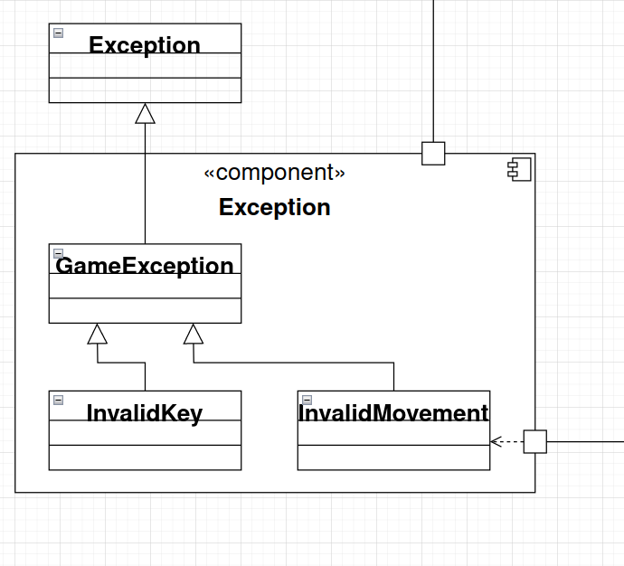

## Descrição das classes de exceção

Classe | Descrição
----- | -----
GameException | Engloba todas as exceções.
InvalidKey | Indica que o usuário pressinou uma técla não válida.
InvalidMovement | Indica que um ator se moveu para uma célula para a qual não pode (ex: parede).

